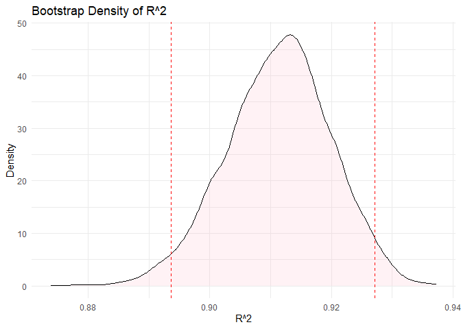
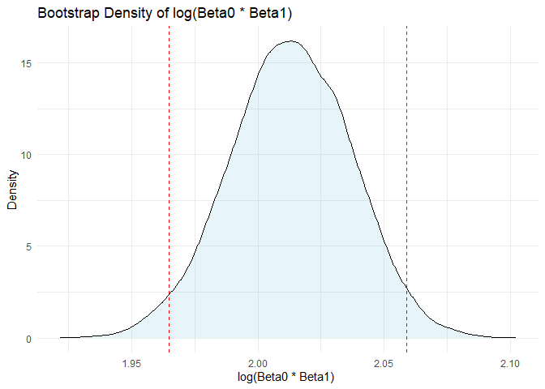
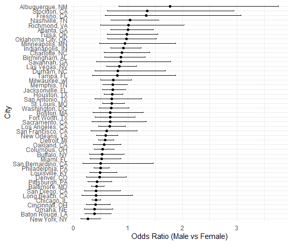
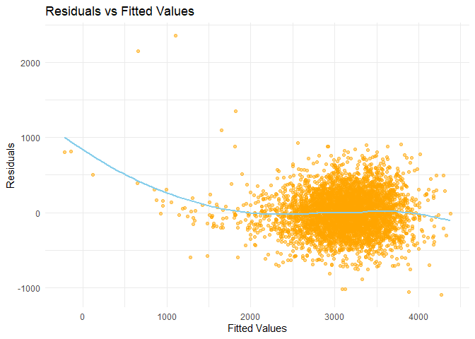

p8105_hw6_WL3011
================
Weiqi Liang
2024-12-02

``` r
library(tidyverse)
library(dplyr)
library(knitr)
set.seed(1)
library(ggplot2)
library(broom)
library(purrr)
library(modelr)
```

## Problem 1

``` r
weather_df = 
  rnoaa::meteo_pull_monitors(
    c("USW00094728"),
    var = c("PRCP", "TMIN", "TMAX"), 
    date_min = "2017-01-01",
    date_max = "2017-12-31") |>
  mutate(
    name = recode(id, USW00094728 = "CentralPark_NY"),
    tmin = tmin / 10,
    tmax = tmax / 10) |>
  select(name, id, everything())
```

Dataset **weather_df** has 365 rows and 6 columns, showing the 2017
Central Park weather data. Each row represents a single day’s weather
data.

First generate 5000 bootstrap samples to estimate the two quantities:

${\hat r^2}$ (R-squared)

$\log ({\hat \beta _0} \cdot {\hat \beta _1})$ (log-transformed product
of coefficients)

``` r
# Bootstrap 
bootstrap_results = weather_df |> 
  modelr::bootstrap(n = 5000) |> 
  mutate(
    models = map(strap, \(df) lm(tmax ~ tmin, data = df)),
    # R^2
    r_squared = map_dbl(models, \(model) broom::glance(model) |> pull(r.squared)),
    # log(Beta0 * Beta1)
    log_beta_product = map_dbl(models, \(model) {
      coefs <- broom::tidy(model) |> pull(estimate)
      log(coefs[1] * coefs[2])
    })
  ) |> 
  select(-strap, -models)
```

Create plots of the bootstrap distributions for ${\hat r^2}$ and
$\log ({\hat \beta _0} \cdot {\hat \beta _1})$.

``` r
ci_r_squared = quantile(bootstrap_results |> pull(r_squared), probs = c(0.025, 0.975))
ci_log_beta_product = quantile(bootstrap_results |> pull(log_beta_product), probs = c(0.025, 0.975))

# R^2 
ggplot(bootstrap_results, aes(x = r_squared)) +
  geom_density(fill = "pink", alpha = 0.2) +
  geom_vline(xintercept = ci_r_squared,
             color = "red", linetype = "dashed") +
  labs(title = "Bootstrap Density of R^2",
       x = "R^2", y = "Density") +
  theme_minimal()
```

<!-- -->

Most of the ${\hat r^2}$ values are concentrated in the region close to
the median value 0.91, and the overall distribution is close to
symmetry.

``` r
# log(Beta0 * Beta1) 
ggplot(bootstrap_results, aes(x = log_beta_product)) +
  geom_density(fill = "skyblue", alpha = 0.2) +
  geom_vline(xintercept = ci_log_beta_product,
             color = "red", linetype = "dashed") +
  labs(title = "Bootstrap Density of log(Beta0 * Beta1) ",
       x = "log(Beta0 * Beta1) ", y = "Density") +
  theme_minimal()
```

<!-- -->

The $\log ({\hat \beta _0} \cdot {\hat \beta _1})$ are mainly
concentrated in the range of pairs from 1.95 to 2.10. The symmetry and
compact shape of the distribution indicate that the measurement is
relatively stable across multiple samples.

Using the bootstrap results, compute the 2.5% and 97.5% quantiles for
both quantities.

``` r
kable(ci_r_squared, 
      col.names = c("quantiles", "value"),
      digits = 4)
```

| quantiles |  value |
|:----------|-------:|
| 2.5%      | 0.8937 |
| 97.5%     | 0.9271 |

``` r
kable(ci_log_beta_product, 
      col.names = c("quantiles", "value"),
      digits = 4)
```

| quantiles |  value |
|:----------|-------:|
| 2.5%      | 1.9649 |
| 97.5%     | 2.0589 |

The 95% CI for ${\hat r^2}$ is (0.8937, 0.9271).

The 95% CI for $\log ({\hat \beta _0} \cdot {\hat \beta _1})$ is
(1.9649, 2.0589).

## Problem 2

First, perform data cleansing as required.

``` r
homicide_data = read_csv("./homicide-data.csv", 
           na = c("NA", ".", "")) |>
           janitor::clean_names() |>
  mutate(city_state = paste(city, state, sep = ", "),
         victim_age = as.numeric(victim_age),
         resolved = ifelse(disposition == "Closed by arrest", 1, 0)) |>
  filter(
    !(city_state %in% c(
      "Dallas, TX", "Phoenix, AZ", "Kansas City, MO", "Tulsa, AL"
      )),
    victim_race %in% c("White", "Black"),
    !is.na(victim_age)) 
```

Then create logistic regression model for Baltimore, MD.

``` r
baltimore_data = homicide_data |>
  filter(city_state == "Baltimore, MD")

baltimore_model = glm(
  resolved ~ victim_age + victim_sex + victim_race,
  data = baltimore_data,
  family = binomial
)

# baltimore OR
baltimore_or = broom::tidy(baltimore_model) |>
  mutate(
    odds_ratio = exp(estimate),
    lower_ci = exp(estimate - 1.96 * std.error),
    upper_ci = exp(estimate + 1.96 * std.error)
  ) |>
  filter(term == "victim_sexMale") |>
select(term, odds_ratio, lower_ci, upper_ci) 

kable(baltimore_or, digits = 4)
```

| term           | odds_ratio | lower_ci | upper_ci |
|:---------------|-----------:|---------:|---------:|
| victim_sexMale |     0.4255 |   0.3246 |   0.5579 |

The Odds Ratio(OR) is 0.4255, meaning that male victims are
significantly less likely to have their cases resolved than female
victims. At a 95% confidence level, the actual OR value may fall between
0.3246 and 0.5579. CI does not contain 1, so this result can be
considered statistically significant.

``` r
# all cities OR
city_or = homicide_data |>
  group_by(city_state) |>
  nest() |>
  mutate(
    models = map(data, \(df) glm(resolved ~ victim_age + victim_sex + victim_race, family = binomial, data = df)),
    or_results = map(models, \(model) broom::tidy(model) |>
                       mutate(
                         odds_ratio = exp(estimate),
                         lower_ci = exp(estimate - 1.96 * std.error),
                         upper_ci = exp(estimate + 1.96 * std.error)
                       ))
  ) |>
  unnest(or_results) |>
  filter(term == "victim_sexMale") |>
  arrange(desc(odds_ratio)) |>
  select(city_state, odds_ratio, lower_ci, upper_ci) 

kable(city_or, digits = 4)
```

| city_state         | odds_ratio | lower_ci | upper_ci |
|:-------------------|-----------:|---------:|---------:|
| Albuquerque, NM    |     1.7675 |   0.8307 |   3.7609 |
| Stockton, CA       |     1.3517 |   0.6211 |   2.9416 |
| Fresno, CA         |     1.3352 |   0.5805 |   3.0709 |
| Nashville, TN      |     1.0342 |   0.6847 |   1.5622 |
| Richmond, VA       |     1.0061 |   0.4980 |   2.0326 |
| Atlanta, GA        |     1.0001 |   0.6836 |   1.4631 |
| Tulsa, OK          |     0.9758 |   0.6136 |   1.5517 |
| Oklahoma City, OK  |     0.9741 |   0.6241 |   1.5203 |
| Minneapolis, MN    |     0.9470 |   0.4783 |   1.8749 |
| Indianapolis, IN   |     0.9187 |   0.6794 |   1.2423 |
| Charlotte, NC      |     0.8839 |   0.5570 |   1.4027 |
| Birmingham, AL     |     0.8700 |   0.5743 |   1.3180 |
| Savannah, GA       |     0.8670 |   0.4223 |   1.7801 |
| Las Vegas, NV      |     0.8373 |   0.6077 |   1.1537 |
| Durham, NC         |     0.8124 |   0.3920 |   1.6833 |
| Tampa, FL          |     0.8077 |   0.3478 |   1.8760 |
| Milwaukee, wI      |     0.7271 |   0.4987 |   1.0602 |
| Memphis, TN        |     0.7232 |   0.5292 |   0.9884 |
| Jacksonville, FL   |     0.7198 |   0.5365 |   0.9657 |
| Houston, TX        |     0.7110 |   0.5577 |   0.9066 |
| San Antonio, TX    |     0.7046 |   0.3977 |   1.2485 |
| St. Louis, MO      |     0.7032 |   0.5304 |   0.9323 |
| Washington, DC     |     0.6902 |   0.4684 |   1.0170 |
| Boston, MA         |     0.6740 |   0.3560 |   1.2760 |
| Fort Worth, TX     |     0.6690 |   0.3969 |   1.1275 |
| Sacramento, CA     |     0.6688 |   0.3347 |   1.3365 |
| Los Angeles, CA    |     0.6619 |   0.4581 |   0.9563 |
| San Francisco, CA  |     0.6075 |   0.3168 |   1.1651 |
| New Orleans, LA    |     0.5849 |   0.4218 |   0.8112 |
| Detroit, MI        |     0.5823 |   0.4622 |   0.7337 |
| Oakland, CA        |     0.5631 |   0.3651 |   0.8684 |
| Columbus, OH       |     0.5325 |   0.3783 |   0.7496 |
| Buffalo, NY        |     0.5206 |   0.2898 |   0.9352 |
| Miami, FL          |     0.5152 |   0.3045 |   0.8719 |
| San Bernardino, CA |     0.5003 |   0.1712 |   1.4622 |
| Philadelphia, PA   |     0.4963 |   0.3776 |   0.6522 |
| Louisville, KY     |     0.4906 |   0.3047 |   0.7897 |
| Denver, CO         |     0.4791 |   0.2364 |   0.9707 |
| Pittsburgh, PA     |     0.4308 |   0.2651 |   0.6999 |
| Baltimore, MD      |     0.4255 |   0.3246 |   0.5579 |
| San Diego, CA      |     0.4130 |   0.1995 |   0.8550 |
| Long Beach, CA     |     0.4102 |   0.1555 |   1.0821 |
| Chicago, IL        |     0.4101 |   0.3360 |   0.5006 |
| Cincinnati, OH     |     0.3998 |   0.2361 |   0.6771 |
| Omaha, NE          |     0.3825 |   0.2030 |   0.7208 |
| Baton Rouge, LA    |     0.3814 |   0.2093 |   0.6953 |
| New York, NY       |     0.2624 |   0.1379 |   0.4991 |

``` r
ggplot(city_or, aes(x = reorder(city_state, odds_ratio), y = odds_ratio)) +
  geom_point() +
  geom_errorbar(aes(ymin = lower_ci, ymax = upper_ci), width = 0.2) +
  coord_flip() +
  labs(
    x = "City",
    y = "Odds Ratio (Male vs Female)"
  ) +
  theme_minimal()
```

<figure>

<figcaption aria-hidden="true">Figure 3. Adjusted Odds Ratios by
City</figcaption>
</figure>

The vast majority of cities have an OR of less than 1, indicating that
male victims have a lower probability of case resolution than female
victims. However, cities such as San Francisco, CA, and Oakland, CA have
an OR close to 1 and a confidence interval that crosses 1. This means
that there is no significant difference in the likelihood of cases being
resolved between men and women in these cities. A few cities (such as
Albuquerque, NM, and Stockton, CA) have an OR greater than 1, indicating
a higher probability of case resolution for men than for women.

In addition, some cities (such as Albuquerque, NM, and San Bernardino,
CA) have wide confidence intervals, indicating that these cities may
have insufficient data and less accurate estimates.

## Problem 3

``` r
birthweight_data = read_csv("./birthweight.csv", 
           na = c("NA", ".", "")) |>
           janitor::clean_names() |>
  mutate(
    babysex = factor(case_when(
      babysex == 1 ~ "male",
      babysex == 2 ~ "female")),
    frace = factor(case_when(
      frace == 1 ~ "White",
      frace == 2 ~ "Black",
      frace == 3 ~ "Asian",
      frace == 4 ~ "Puerto Rican",
      frace == 8 ~ "Other",
      frace == 9 ~ "Unknown")),
    mrace = factor(case_when(
      mrace == 1 ~ "White",
      mrace == 2 ~ "Black",
      mrace == 3 ~ "Asian",
      mrace == 4 ~ "Puerto Rican",
      mrace == 8 ~ "Other")),
    malform = factor(case_when(
      malform == 0 ~ "absent",
      malform == 1 ~ "present"))) |>
  drop_na()
```

Stepwise regression is performed, and the optimal variable set is
selected automatically through AIC.

``` r
# Stepwise regression
library(MASS)

full_model = lm(bwt ~ ., data = birthweight_data)
null_model = lm(bwt ~ 1, data = birthweight_data)
selected_model = stepAIC(
  object = null_model,         
  scope = list(lower = null_model, upper = full_model),  
  direction = "both",         
  trace = FALSE               
)

detach("package:MASS", unload = TRUE)

summary(selected_model)
```

    ## 
    ## Call:
    ## lm(formula = bwt ~ bhead + blength + mrace + delwt + gaweeks + 
    ##     smoken + ppbmi + babysex + parity + wtgain + fincome, data = birthweight_data)
    ## 
    ## Residuals:
    ##      Min       1Q   Median       3Q      Max 
    ## -1092.96  -185.39    -3.44   174.19  2354.22 
    ## 
    ## Coefficients:
    ##                     Estimate Std. Error t value Pr(>|t|)    
    ## (Intercept)       -5731.1074   107.2850 -53.419  < 2e-16 ***
    ## bhead               130.8391     3.4470  37.958  < 2e-16 ***
    ## blength              74.9783     2.0190  37.137  < 2e-16 ***
    ## mraceBlack          -62.4809    42.3725  -1.475 0.140403    
    ## mracePuerto Rican   -25.4289    45.3711  -0.560 0.575191    
    ## mraceWhite           76.3488    42.3170   1.804 0.071268 .  
    ## delwt                 3.0406     0.4116   7.387 1.79e-13 ***
    ## gaweeks              11.5806     1.4622   7.920 2.99e-15 ***
    ## smoken               -4.8443     0.5857  -8.272  < 2e-16 ***
    ## ppbmi                -9.2219     2.5771  -3.578 0.000349 ***
    ## babysexmale         -28.5570     8.4560  -3.377 0.000739 ***
    ## parity               95.8952    40.3394   2.377 0.017487 *  
    ## wtgain                1.0679     0.5677   1.881 0.060039 .  
    ## fincome               0.3230     0.1747   1.849 0.064562 .  
    ## ---
    ## Signif. codes:  0 '***' 0.001 '**' 0.01 '*' 0.05 '.' 0.1 ' ' 1
    ## 
    ## Residual standard error: 272.4 on 4328 degrees of freedom
    ## Multiple R-squared:  0.718,  Adjusted R-squared:  0.7172 
    ## F-statistic: 847.8 on 13 and 4328 DF,  p-value: < 2.2e-16

``` r
hypothesis_model = lm(bwt ~ bhead + blength + mrace + delwt + gaweeks + 
    smoken + ppbmi + babysex + parity + wtgain + fincome, data = birthweight_data)

# Residuals vs. Fitted Values Plot
birthweight_data = birthweight_data |>
  add_predictions(hypothesis_model) |>
  add_residuals(hypothesis_model)

ggplot(birthweight_data, aes(x = pred, y = resid)) +
  geom_point(alpha = 0.5, color = "orange") +
  geom_smooth(method = "loess", color = "skyblue", se = FALSE) +
  labs(title = "Residuals vs Fitted Values",
       x = "Fitted Values",
       y = "Residuals") +
  theme_minimal()
```

<!-- -->

``` r
model1 = lm(bwt ~ blength + gaweeks, data = birthweight_data)
model2 = lm(bwt ~ bhead + blength + babysex + 
              bhead * blength + blength * babysex + bhead * babysex +
              bhead * blength * babysex, data = birthweight_data)

# Evaluate models with cross-validation
cv_results = crossv_mc(birthweight_data, n = 100) |>
  mutate(
    hypothesis_model = map(train, ~hypothesis_model),
    model1 = map(train, ~model1),
    model2 = map(train, ~model2),
    rmse_hypothesis = map2_dbl(hypothesis_model, test, \(Model, df) rmse(model = Model, data = df)),
    rmse_model1 = map2_dbl(model1, test, \(Model, df) rmse(model = Model, data = df)),
    rmse_model2 = map2_dbl(model2, test, \(Model, df) rmse(model = Model, data = df)),
  )

# Summarize average RMSE for each model
cv_summary = cv_results |>
  summarize(
    hypothesis_rmse = mean(rmse_hypothesis),
    model1_rmse = mean(rmse_model1),
    model2_rmse = mean(rmse_model2)
  )

kable(cv_summary, digits = 4)
```

| hypothesis_rmse | model1_rmse | model2_rmse |
|----------------:|------------:|------------:|
|        272.1153 |    333.8388 |    288.0699 |

The **Hypothesis Model** had the lowest RMSE, indicating that it
captured more key variables and information, and had the best predictive
performance for birth weight. Although Model 2 improves performance by
including interaction terms, it is still slightly inferior to Hypothesis
Model due to increased complexity. Model 1 is the simplest model, but it
misses many important predictors and has a large prediction error.
