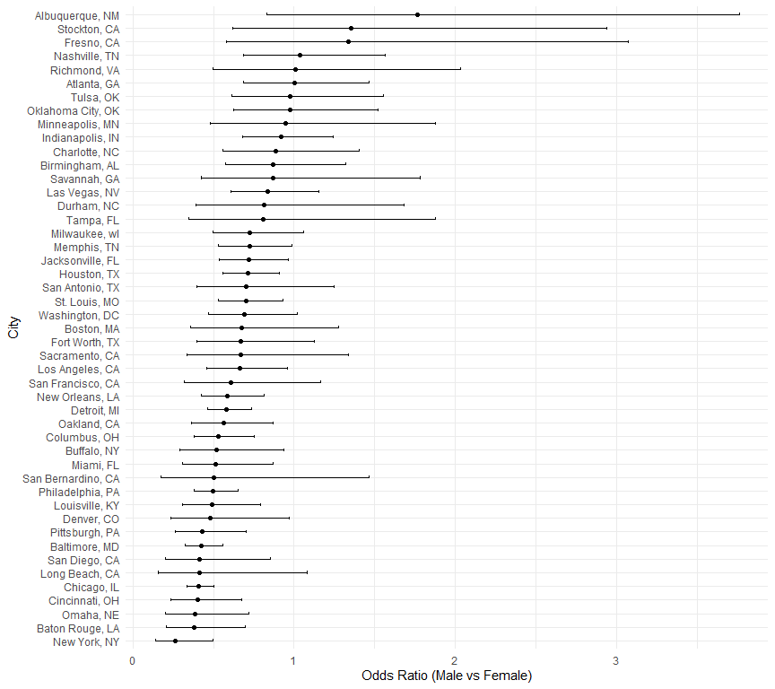

p8105_hw6_WL3011
================
Weiqi Liang
2024-12-02

``` r
library(tidyverse)
library(dplyr)
library(knitr)
set.seed(1)
library(ggplot2)
library(broom)
library(purrr)
```

## Problem 1

``` r
weather_df = 
  rnoaa::meteo_pull_monitors(
    c("USW00094728"),
    var = c("PRCP", "TMIN", "TMAX"), 
    date_min = "2017-01-01",
    date_max = "2017-12-31") |>
  mutate(
    name = recode(id, USW00094728 = "CentralPark_NY"),
    tmin = tmin / 10,
    tmax = tmax / 10) |>
  select(name, id, everything())
```

Dataset **weather_df** has 365 rows and 6 columns, showing the 2017
Central Park weather data. Each row represents a single day’s weather
data.

First generate 5000 bootstrap samples to estimate the two quantities:

${\hat r^2}$ (R-squared)

$\log ({\hat \beta _0} \cdot {\hat \beta _1})$ (log-transformed product
of coefficients)

``` r
# Bootstrap 
bootstrap_results = weather_df |> 
  modelr::bootstrap(n = 5000) |> 
  mutate(
    models = map(strap, \(df) lm(tmax ~ tmin, data = df)),
    # R^2
    r_squared = map_dbl(models, \(model) broom::glance(model) |> pull(r.squared)),
    # log(Beta0 * Beta1)
    log_beta_product = map_dbl(models, \(model) {
      coefs <- broom::tidy(model) |> pull(estimate)
      log(coefs[1] * coefs[2])
    })
  ) |> 
  select(-strap, -models)
```

Create plots of the bootstrap distributions for ${\hat r^2}$ and
$\log ({\hat \beta _0} \cdot {\hat \beta _1})$.

``` r
ci_r_squared = quantile(bootstrap_results |> pull(r_squared), probs = c(0.025, 0.975))
ci_log_beta_product = quantile(bootstrap_results |> pull(log_beta_product), probs = c(0.025, 0.975))

# R^2 
ggplot(bootstrap_results, aes(x = r_squared)) +
  geom_density(fill = "pink", alpha = 0.2) +
  geom_vline(xintercept = ci_r_squared,
             color = "red", linetype = "dashed") +
  labs(title = "Bootstrap Density of R^2",
       x = "R^2", y = "Density") +
  theme_minimal()
```

<!-- -->

Most of the ${\hat r^2}$ values are concentrated in the region close to
the median value 0.91, and the overall distribution is close to
symmetry.

``` r
# log(Beta0 * Beta1) 
ggplot(bootstrap_results, aes(x = log_beta_product)) +
  geom_density(fill = "skyblue", alpha = 0.2) +
  geom_vline(xintercept = ci_log_beta_product,
             color = "red", linetype = "dashed") +
  labs(title = "Bootstrap Density of log(Beta0 * Beta1) ",
       x = "log(Beta0 * Beta1) ", y = "Density") +
  theme_minimal()
```

<!-- -->

The $\log ({\hat \beta _0} \cdot {\hat \beta _1})$ are mainly
concentrated in the range of pairs from 1.95 to 2.10. The symmetry and
compact shape of the distribution indicate that the measurement is
relatively stable across multiple samples.

Using the bootstrap results, compute the 2.5% and 97.5% quantiles for
both quantities.

``` r
kable(ci_r_squared, 
      col.names = c("quantiles", "value"),
      digits = 4)
```

| quantiles |  value |
|:----------|-------:|
| 2.5%      | 0.8937 |
| 97.5%     | 0.9271 |

``` r
kable(ci_log_beta_product, 
      col.names = c("quantiles", "value"),
      digits = 4)
```

| quantiles |  value |
|:----------|-------:|
| 2.5%      | 1.9649 |
| 97.5%     | 2.0589 |

The 95% CI for ${\hat r^2}$ is (0.8937, 0.9271).

The 95% CI for $\log ({\hat \beta _0} \cdot {\hat \beta _1})$ is
(1.9649, 2.0589).

## Problem 2

First, perform data cleansing as required.

``` r
homicide_data = read_csv("./homicide-data.csv", 
           na = c("NA", ".", "")) |>
           janitor::clean_names() |>
  mutate(city_state = paste(city, state, sep = ", "),
         victim_age = as.numeric(victim_age),
         resolved = ifelse(disposition == "Closed by arrest", 1, 0)) |>
  filter(
    !(city_state %in% c(
      "Dallas, TX", "Phoenix, AZ", "Kansas City, MO", "Tulsa, AL"
      )),
    victim_race %in% c("White", "Black"),
    !is.na(victim_age)) 
```

Then create logistic regression model for Baltimore, MD.

``` r
baltimore_data = homicide_data |>
  filter(city_state == "Baltimore, MD")

baltimore_model = glm(
  resolved ~ victim_age + victim_sex + victim_race,
  data = baltimore_data,
  family = binomial
)

# baltimore OR
baltimore_or = broom::tidy(baltimore_model) |>
  mutate(
    odds_ratio = exp(estimate),
    lower_ci = exp(estimate - 1.96 * std.error),
    upper_ci = exp(estimate + 1.96 * std.error)
  ) |>
  filter(term == "victim_sexMale") |>
select(term, odds_ratio, lower_ci, upper_ci) 

kable(baltimore_or, digits = 4)
```

| term           | odds_ratio | lower_ci | upper_ci |
|:---------------|-----------:|---------:|---------:|
| victim_sexMale |     0.4255 |   0.3246 |   0.5579 |

The Odds Ratio(OR) is 0.4255, meaning that male victims are
significantly less likely to have their cases resolved than female
victims. At a 95% confidence level, the actual OR value may fall between
0.3246 and 0.5579. CI does not contain 1, so this result can be
considered statistically significant.

``` r
# all cities OR
city_or = homicide_data |>
  group_by(city_state) |>
  nest() |>
  mutate(
    models = map(data, \(df) glm(resolved ~ victim_age + victim_sex + victim_race, family = binomial, data = df)),
    or_results = map(models, \(model) broom::tidy(model) |>
                       mutate(
                         odds_ratio = exp(estimate),
                         lower_ci = exp(estimate - 1.96 * std.error),
                         upper_ci = exp(estimate + 1.96 * std.error)
                       ))
  ) |>
  unnest(or_results) |>
  filter(term == "victim_sexMale") |>
  arrange(desc(odds_ratio)) |>
  select(city_state, odds_ratio, lower_ci, upper_ci) 

kable(city_or, digits = 4)
```

| city_state         | odds_ratio | lower_ci | upper_ci |
|:-------------------|-----------:|---------:|---------:|
| Albuquerque, NM    |     1.7675 |   0.8307 |   3.7609 |
| Stockton, CA       |     1.3517 |   0.6211 |   2.9416 |
| Fresno, CA         |     1.3352 |   0.5805 |   3.0709 |
| Nashville, TN      |     1.0342 |   0.6847 |   1.5622 |
| Richmond, VA       |     1.0061 |   0.4980 |   2.0326 |
| Atlanta, GA        |     1.0001 |   0.6836 |   1.4631 |
| Tulsa, OK          |     0.9758 |   0.6136 |   1.5517 |
| Oklahoma City, OK  |     0.9741 |   0.6241 |   1.5203 |
| Minneapolis, MN    |     0.9470 |   0.4783 |   1.8749 |
| Indianapolis, IN   |     0.9187 |   0.6794 |   1.2423 |
| Charlotte, NC      |     0.8839 |   0.5570 |   1.4027 |
| Birmingham, AL     |     0.8700 |   0.5743 |   1.3180 |
| Savannah, GA       |     0.8670 |   0.4223 |   1.7801 |
| Las Vegas, NV      |     0.8373 |   0.6077 |   1.1537 |
| Durham, NC         |     0.8124 |   0.3920 |   1.6833 |
| Tampa, FL          |     0.8077 |   0.3478 |   1.8760 |
| Milwaukee, wI      |     0.7271 |   0.4987 |   1.0602 |
| Memphis, TN        |     0.7232 |   0.5292 |   0.9884 |
| Jacksonville, FL   |     0.7198 |   0.5365 |   0.9657 |
| Houston, TX        |     0.7110 |   0.5577 |   0.9066 |
| San Antonio, TX    |     0.7046 |   0.3977 |   1.2485 |
| St. Louis, MO      |     0.7032 |   0.5304 |   0.9323 |
| Washington, DC     |     0.6902 |   0.4684 |   1.0170 |
| Boston, MA         |     0.6740 |   0.3560 |   1.2760 |
| Fort Worth, TX     |     0.6690 |   0.3969 |   1.1275 |
| Sacramento, CA     |     0.6688 |   0.3347 |   1.3365 |
| Los Angeles, CA    |     0.6619 |   0.4581 |   0.9563 |
| San Francisco, CA  |     0.6075 |   0.3168 |   1.1651 |
| New Orleans, LA    |     0.5849 |   0.4218 |   0.8112 |
| Detroit, MI        |     0.5823 |   0.4622 |   0.7337 |
| Oakland, CA        |     0.5631 |   0.3651 |   0.8684 |
| Columbus, OH       |     0.5325 |   0.3783 |   0.7496 |
| Buffalo, NY        |     0.5206 |   0.2898 |   0.9352 |
| Miami, FL          |     0.5152 |   0.3045 |   0.8719 |
| San Bernardino, CA |     0.5003 |   0.1712 |   1.4622 |
| Philadelphia, PA   |     0.4963 |   0.3776 |   0.6522 |
| Louisville, KY     |     0.4906 |   0.3047 |   0.7897 |
| Denver, CO         |     0.4791 |   0.2364 |   0.9707 |
| Pittsburgh, PA     |     0.4308 |   0.2651 |   0.6999 |
| Baltimore, MD      |     0.4255 |   0.3246 |   0.5579 |
| San Diego, CA      |     0.4130 |   0.1995 |   0.8550 |
| Long Beach, CA     |     0.4102 |   0.1555 |   1.0821 |
| Chicago, IL        |     0.4101 |   0.3360 |   0.5006 |
| Cincinnati, OH     |     0.3998 |   0.2361 |   0.6771 |
| Omaha, NE          |     0.3825 |   0.2030 |   0.7208 |
| Baton Rouge, LA    |     0.3814 |   0.2093 |   0.6953 |
| New York, NY       |     0.2624 |   0.1379 |   0.4991 |

``` r
ggplot(city_or, aes(x = reorder(city_state, odds_ratio), y = odds_ratio)) +
  geom_point() +
  geom_errorbar(aes(ymin = lower_ci, ymax = upper_ci), width = 0.2) +
  coord_flip() +
  labs(
    x = "City",
    y = "Odds Ratio (Male vs Female)"
  ) +
  theme_minimal()
```

<figure>

<figcaption aria-hidden="true">Figure 3. Adjusted Odds Ratios by
City</figcaption>
</figure>
